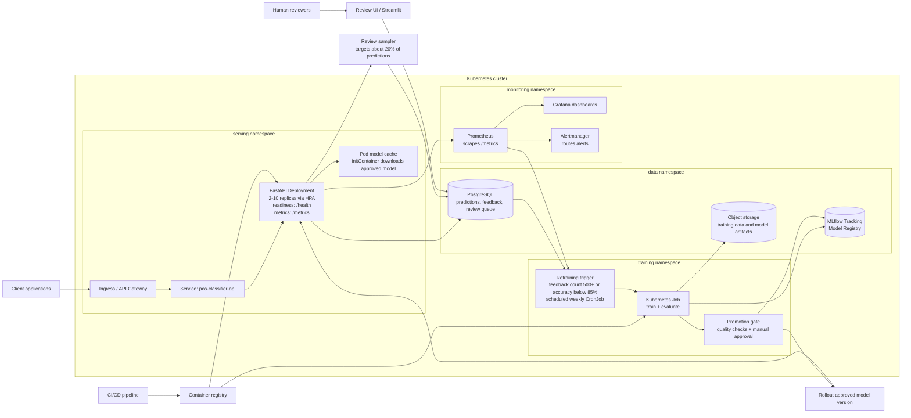
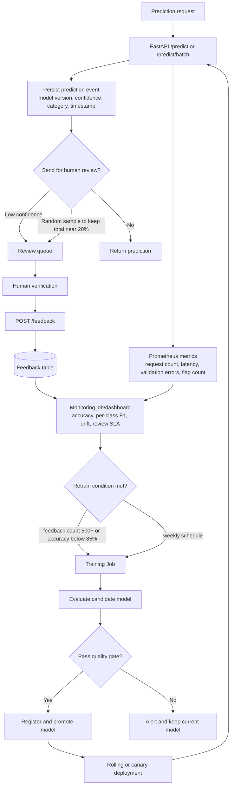
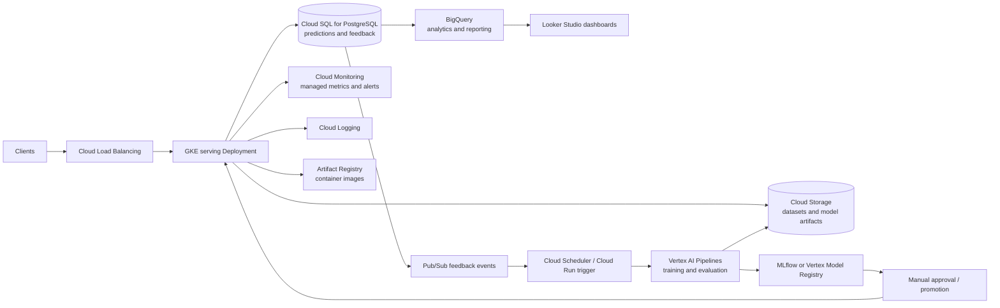

# Deployment Architecture

This document describes a production deployment design for the POS product description classifier. The local implementation keeps the exercise lightweight with SQLite and local model artifacts, while the production design separates serving, feedback storage, model registry, retraining, monitoring, and promotion gates.

## Kubernetes Deployment Flowchart

## Monitoring and Feedback Loop

The review policy should target approximately 20% of total predictions for human verification. Low-confidence predictions get priority; the random sampler fills the remaining review budget so the reviewed set is representative without overwhelming reviewers.

## Production Kubernetes Structure

| Component | Kubernetes resources | Purpose |
|---|---|---|
| API endpoint | `Deployment`, `Service`, `Ingress`, `HPA` | Serves prediction, feedback, health, and metrics endpoints. |
| Model loading | `initContainer`, read-only model cache | Downloads the approved model version before the API starts. |
| Feedback store | PostgreSQL-compatible database | Stores predictions, review queue rows, and verified labels. |
| Training | `CronJob`, on-demand `Job` | Retrains from original data plus verified feedback. |
| Registry | MLflow Tracking and Model Registry | Stores experiments, artifacts, model versions, and stage transitions. |
| Monitoring | Prometheus, Grafana, Alertmanager | Tracks service/model health and routes alerts. |
| Config/security | `Secret`, `ConfigMap`, service account | Manages database credentials, thresholds, registry URI, and cloud access. |

## Model Promotion Strategy

Training jobs must not overwrite the model currently used by serving pods. A safer production flow is:

1. Train a candidate model from approved datasets and human-verified feedback.
2. Log metrics, confusion matrix, and artifacts to MLflow.
3. Evaluate gates such as minimum accuracy, per-class F1, latency, and regression versus the current production model.
4. Register the candidate as a new model version.
5. Promote to `Staging` for validation, then to `Production` after approval.
6. Roll out serving pods with the approved model version using rolling, blue-green, or canary deployment.
7. Keep the previous production version available for rollback.

## Optional GCP Deployment Flowchart

## GCP Component Mapping

| Kubernetes/local concept | GCP service | Purpose |
|---|---|---|
| Container image registry | Artifact Registry | Stores immutable API and trainer images. |
| Kubernetes cluster | GKE | Runs FastAPI, review UI, Prometheus-compatible agents, and jobs. |
| Prediction and feedback database | Cloud SQL for PostgreSQL | Durable transactional storage for model events and human labels. |
| Datasets and artifacts | Cloud Storage | Versioned object storage for training data, evaluation outputs, and model files. |
| Training job | Vertex AI Pipelines | Managed retraining, evaluation, lineage, and repeatability. |
| Feedback/retraining events | Pub/Sub | Decouples API traffic from retraining triggers. |
| Metrics and alerts | Cloud Monitoring and Cloud Logging | Centralized SLOs, logs, alerts, and incident routing. |
| Business reporting | BigQuery and Looker Studio | Long-term analytics over prediction and feedback history. |

## Manifest Sketch

The production manifests would be generated with Helm, Kustomize, or GitOps. Key settings:

- API `Deployment`: immutable image tag, readiness/liveness probes on `/health`, Prometheus scrape annotations for `/metrics`, CPU/memory requests and limits, and rolling updates with `maxUnavailable: 0`.
- Model loading: init container downloads the approved `Production` model version from MLflow or object storage into a read-only pod cache.
- Scaling: `HorizontalPodAutoscaler` keeps 2-10 API replicas based on CPU or request latency.
- Training: `CronJob` runs weekly, and an on-demand `Job` can be triggered by feedback volume or accuracy degradation; `concurrencyPolicy: Forbid` prevents overlapping training runs.
- Secrets/config: database credentials, registry URI, sampling rate, confidence threshold, and cloud credentials are provided via `Secret` and `ConfigMap`.
- Release safety: new models are promoted through the registry and rolled out with rolling, blue-green, or canary deployment; serving pods never read from a trainer-written shared PVC.

## Operational Notes

- Keep SQLite only for local development; use PostgreSQL-compatible storage in production.
- Store model artifacts in MLflow/object storage, not on a shared serving PVC.
- Alert on API errors, p95 latency, validation failures, review queue age, model accuracy, class-level regression, and data drift.
- Track review sampling rate so the verified stream remains close to 20% of predictions.
- Require an approval gate before production rollout and keep the previous model available for rollback.
